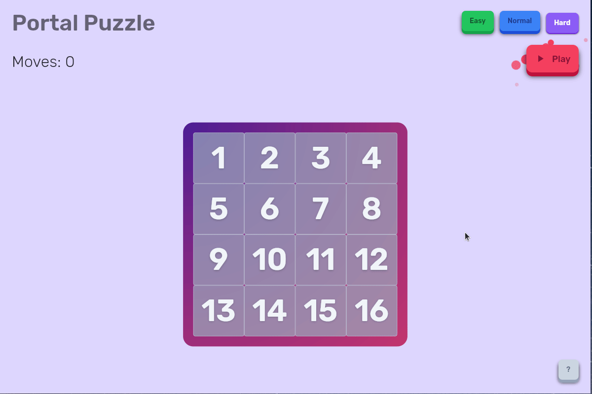

# Portal Puzzle

In the digital world you don\'t have to be limited by an analog box

## How to play

1. Press the Play button.
2. Wait until the shuffling ends.
3. Move the tiles horizontally or vertically until you find the solution.

## Tips & Tricks

- You can select a difficulty. Maybe start from the Easy one.
- You can use your keyboard to control everything. To see the keyboard shortcuts, press the space
  bar at any time.

## About Portal Puzzle

Portal Puzzle was created as a project for the [Flutter Puzzle Hack](https://flutterhack.devpost.com/). The classic 15 slide puzzle is
fun until you figure out (or see on internet) how to easily solve it every time.
When I had a chance to create the puzzle in the digital form, I thought: why not do something which is not a strict copy of the "analog" box with tiles.
Why not allow those tiles to move through "portals"... The rest is history (git log).

## Play in your browser

[Portal Puzzle online](https://mivoligo.github.io/puzzle/)

## Download for Linux 

## Download for Android

Coming soon